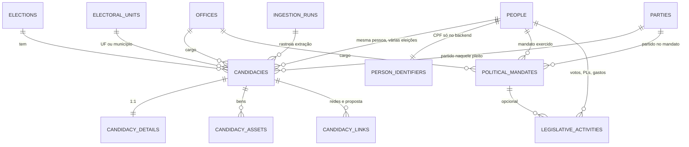
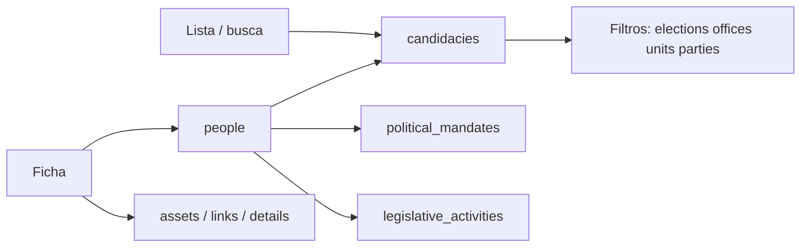
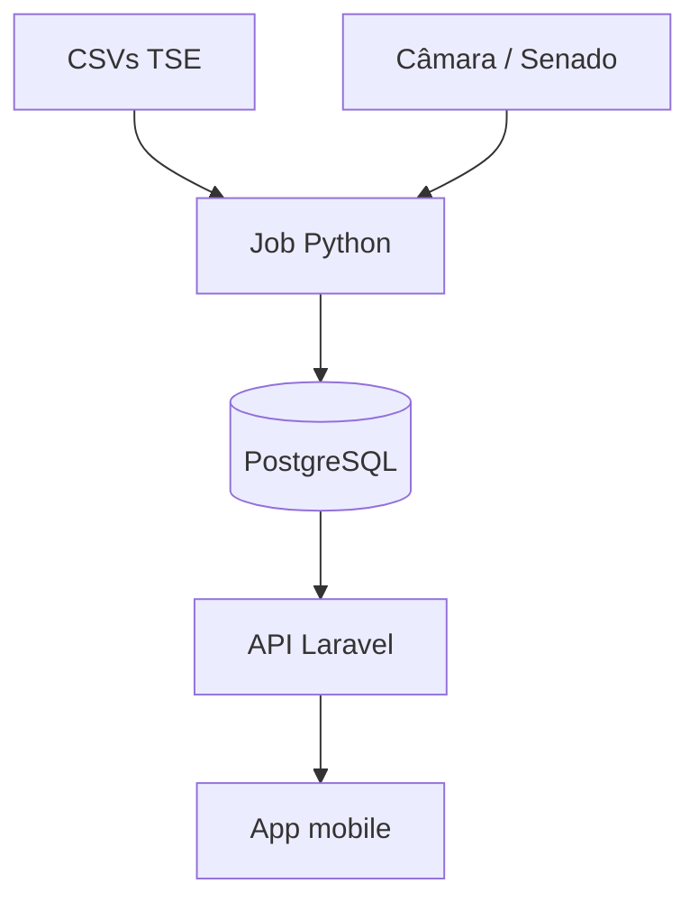

# Modelagem do banco — app informativo de candidatos
Documento de referência da modelagem relacional para um aplicativo mobile informativo com dados de candidatos (fonte principal: TSE) e histórico político (TSE + Câmara/Senado).
**Banco recomendado:** PostgreSQL (busca por nome com `pg_trgm`, `JSONB`, índices parciais).
**Regra de ouro:** a lista do app **não é pessoa**. É **candidatura**. Pessoa existe para unir a carreira; o resto é dimensão de filtro, detalhe pesado ou auditoria.
---
## 1. Como o app consulta
| Tela | Tabela principal | Paginação |
| --- | --- | --- |
| Busca / lista | `candidacies` | cursor (`id` ou `(ballot_name, id)`) |
| Filtros (UF, cargo, partido, eleito) | FKs + colunas denormalizadas em `candidacies` | mesma query |
| Ficha | `people` + candidaturas + mandatos | — |
| Atividade no Congresso | `legislative_activities` | cursor por data |
Offset (`?page=50`) fica lento com centenas de milhares de linhas. Use **cursor**.
Filtros típicos da API:
```http
GET /candidacies?election_id=&uf=&office_id=&party_id=&q=&elected=&status=&cursor=
```
---
## 2. Diagrama entidade-relacionamento

Fluxo de tela:

Arquitetura de dados (ingest → API → app):

O app **não** lê CSV e **não** chama o TSE. O Python grava no banco; o Laravel só lê e pagina.
---
## 3. Princípio: a lista não é “pessoa”
No TSE, a unidade natural é **uma candidatura numa eleição** (`SQ_CANDIDATO` + ano + turno). A mesma pessoa pode ser vereador em 2016 e deputado em 2022: duas linhas, um `person_id`.
Se a tabela principal fosse `people`, todo filtro (UF, cargo, partido, eleito) exigiria join com “a candidatura da eleição atual”, índices piores e paginação instável. A card do app é sempre um pleito: nome de urna, número, partido, cidade.
---
## 4. Por que cada tabela
### 4.1 Dimensões: `elections`, `offices`, `electoral_units`, `parties`
Filtro no mobile precisa de **inteiro estável**, não de `WHERE ds_cargo ILIKE 'deputado%'`.
| Tabela | Papel | Por quê |
| --- | --- | --- |
| `elections` | Ano, tipo (ordinária/suplementar), abrangência, `CD_ELEICAO` | Sem isso mistura 2024 municipal com 2026 geral |
| `offices` | Cargo (`CD_CARGO`) | Segundo filtro mais usado depois de UF; o código TSE é estável, o nome pode mudar |
| `electoral_units` | País, UF ou município (`SG_UE`) | Hierarquia município → UF permite “candidatos de Campinas” sem parsear string. `ibge_code` entra depois (mapa) |
| `parties` | Número, sigla, nome | Partido muda de nome; a candidatura **congela** o que valia naquele pleito (`party_acronym` denormalizado). A tabela alimenta o combo da tela |

Listas de filtro (UFs, cargos, partidos) saem das dimensões e devem ser **cacheadas**. Não faça `DISTINCT` em milhões de candidaturas a cada request.
### 4.2 `people` + `person_identifiers`
Carreira = a mesma pessoa em várias linhas de `candidacies`.
- **`people`:** o que a ficha pode mostrar (nome, nascimento, gênero). Sem documento.
- **`person_identifiers`:** CPF e título, usados **só** pelo job Python para amarrar 2018 com 2022. Tabela separada para o Eloquent não vazar CPF num `Person::with(...)` nem num dump de log.
Hash no lugar de CPF quebraria o cruzamento se o TSE mudar formatação. CPF no backend, **nunca** na API.
### 4.3 `candidacies` — o coração
Uma linha = um candidato na urna daquele turno.
Colunas denormalizadas (`uf`, `unit_name`, `office_name`, `party_acronym`, `is_elected`):
- A lista **não faz 4 joins** só para desenhar o card.
- Índices compostos batem com a query real: `(election_id, uf, office_id, id)`.
- `is_elected` boolean evita `WHERE result ILIKE 'eleito%'` (o TSE tem “eleito por média”, “eleito por qp”, suplente, etc.).
`turn` entra na chave única `(election_id, tse_sq_candidato, turn)`: segundo turno é outra linha, não um update da primeira.
`source_extracted_at` (ou via `ingestion_runs`) permite o app dizer “TSE, extraído em…”. Dado eleitoral sem data de extração parece oficial demais.
### 4.4 `candidacy_details` (1:1)
Coligação, federação, número de processo, estado civil, JSON do que sobrar do CSV.
Se isso fosse coluna de `candidacies`, a listagem paginada leria páginas largas à toa. Split 1:1 = a ficha carrega no `GET /candidacies/{id}`; a lista não.
### 4.5 `candidacy_assets` e `candidacy_links`
Bens são **N por candidato** (às vezes dezenas). Redes e PDF de proposta também são N.
Não vão em JSON numa coluna da lista: JSON não pagina, não soma patrimônio com índice e infla o row. Tabelas filhas: a ficha pede bens só quando abre; a lista no máximo um boolean `declared_assets`.
### 4.6 `political_mandates`
“Já foi candidato” ≠ “exerceu mandato”. O TSE cobre o primeiro; Câmara/Senado cobrem o segundo.
Mandato tem casa, legislatura, datas, `external_id` (id da Câmara ou código do Senado). Sem essa tabela você tentaria inferir mandato só com `is_elected`, e erraria (eleito que não tomou posse, suplente que assumiu, cassação).
### 4.7 `legislative_activities`
Votações, proposições, discursos, CEAP: volume alto e **outra tela paginada** (`kind` + `occurred_at`).
Não misturar isso em `candidacies`. Índice `(person_id, kind, occurred_at DESC, id)` = cursor estável na aba “Atividade”. `metadata` JSONB guarda o que varia (número do PL, voto sim/não) sem 15 tabelas no MVP.
### 4.8 `ingestion_runs`
Pipeline quebra (CSV muda coluna, TSE fora do ar). É preciso saber qual arquivo rodou, quando, quantas linhas e se falhou. O app pode mostrar “dados de 12h atrás”; o operador vê o job vermelho.
---
## 5. O que não entra em `candidacies`
| Dado | Onde fica | Motivo |
| --- | --- | --- |
| CPF, e-mail, título | `person_identifiers` (nunca na API) | LGPD e vazamento trivial |
| Lista de bens | `candidacy_assets` | N por candidato; infla a lista |
| JSON bruto do TSE | `candidacy_details.extra` | A lista precisa de colunas filtráveis |
| Textos de proposições | `legislative_activities` | Outra tela, outro volume |
Card da lista ≈ 15 colunas. Ficha = joins pontuais.
---
## 6. Relação com os arquivos do governo
| Fonte | Tabela |
| --- | --- |
| TSE `consulta_cand` | `elections`, `offices`, `electoral_units`, `parties`, `people`, `candidacies`, `candidacy_details` |
| TSE bens | `candidacy_assets` |
| TSE redes / proposta | `candidacy_links` |
| TSE fotos | `candidacies.photo_url` |
| TSE resultados (`votacao_*`) | `result`, `is_elected` |
| TSE eleições anteriores (mesmo CPF) | novas linhas em `candidacies` + mesmo `person_id` |
| Câmara / Senado | `political_mandates` + `legislative_activities` |
O Python faz upsert:
- pessoa: `cpf` em `person_identifiers`
- candidatura: `(election_id, tse_sq_candidato, turn)`
Histórico político na ficha:
```sql
SELECT * FROM candidacies WHERE person_id = ? ORDER BY /* ano da eleição */ DESC;
```
Quem teve mandato ganha o bloco extra de `political_mandates`.
---
## 7. Schema SQL (PostgreSQL)
```sql
CREATE EXTENSION IF NOT EXISTS pg_trgm;
-- Dimensões (filtros = inteiro, não string)
CREATE TABLE elections (
    id              BIGSERIAL PRIMARY KEY,
    year            SMALLINT NOT NULL,
    tse_election_id INTEGER NOT NULL,      -- CD_ELEICAO
    name            TEXT NOT NULL,         -- DS_ELEICAO
    kind            TEXT NOT NULL,         -- ordinaria | suplementar
    scope           TEXT NOT NULL,         -- municipal | estadual | federal
    election_date   DATE,
    UNIQUE (year, tse_election_id)
);
CREATE TABLE offices (
    id          SMALLSERIAL PRIMARY KEY,
    tse_code    SMALLINT NOT NULL UNIQUE, -- CD_CARGO
    name        TEXT NOT NULL,            -- DS_CARGO
    sphere      TEXT NOT NULL             -- municipal | estadual | federal
);
CREATE TABLE electoral_units (
    id            BIGSERIAL PRIMARY KEY,
    tse_ue_code   TEXT NOT NULL,          -- SG_UE (BR, SP, 71072…)
    uf            CHAR(2),
    name          TEXT NOT NULL,          -- NM_UE
    kind          TEXT NOT NULL,          -- pais | uf | municipio
    ibge_code     TEXT,
    parent_id     BIGINT REFERENCES electoral_units(id),
    UNIQUE (tse_ue_code)
);
CREATE INDEX electoral_units_uf_kind_idx ON electoral_units (uf, kind);
CREATE TABLE parties (
    id        SERIAL PRIMARY KEY,
    number    SMALLINT NOT NULL,          -- NR_PARTIDO
    acronym   TEXT NOT NULL,              -- SG_PARTIDO
    name      TEXT NOT NULL,
    UNIQUE (number, acronym)
);
-- Pessoa (carreira). CPF fora desta tabela.
CREATE TABLE people (
    id              BIGSERIAL PRIMARY KEY,
    civil_name      TEXT NOT NULL,
    ballot_name     TEXT,                 -- último nome de urna conhecido
    birth_date      DATE,
    birth_uf        CHAR(2),
    birth_city      TEXT,
    gender_code     SMALLINT,
    race_code       SMALLINT,
    created_at      TIMESTAMPTZ NOT NULL DEFAULT now(),
    updated_at      TIMESTAMPTZ NOT NULL DEFAULT now()
);
CREATE TABLE person_identifiers (
    person_id       BIGINT PRIMARY KEY REFERENCES people(id) ON DELETE CASCADE,
    cpf             CHAR(11),             -- só backend / job Python
    voter_id        TEXT,                 -- título
    UNIQUE (cpf),
    UNIQUE (voter_id)
);
-- Lista do app: 1 linha = 1 candidatura numa eleição/turno
CREATE TABLE candidacies (
    id                      BIGSERIAL PRIMARY KEY,
    person_id               BIGINT NOT NULL REFERENCES people(id),
    election_id             BIGINT NOT NULL REFERENCES elections(id),
    office_id               SMALLINT NOT NULL REFERENCES offices(id),
    electoral_unit_id       BIGINT NOT NULL REFERENCES electoral_units(id),
    party_id                INTEGER NOT NULL REFERENCES parties(id),
    tse_sq_candidato        BIGINT NOT NULL,
    turn                    SMALLINT NOT NULL DEFAULT 1,
    ballot_number           INTEGER NOT NULL,
    ballot_name             TEXT NOT NULL,
    civil_name              TEXT NOT NULL,
    -- denormalizado para filtro/sort sem JOIN
    uf                      CHAR(2) NOT NULL,
    unit_name               TEXT NOT NULL,
    office_name             TEXT NOT NULL,
    party_acronym           TEXT NOT NULL,
    party_number            SMALLINT NOT NULL,
    status_code             INTEGER,
    status                  TEXT,          -- apto, indeferido…
    result_code             INTEGER,
    result                  TEXT,          -- eleito, não eleito, suplente…
    is_elected              BOOLEAN NOT NULL DEFAULT false,
    is_reelection           BOOLEAN,
    inserted_on_ballot      BOOLEAN,
    occupation              TEXT,
    education               TEXT,
    age_at_election         SMALLINT,
    gender_code             SMALLINT,
    race_code               SMALLINT,
    photo_url               TEXT,
    max_campaign_expense    NUMERIC(15,2),
    declared_assets         BOOLEAN,
    source_extracted_at     TIMESTAMPTZ NOT NULL,
    UNIQUE (election_id, tse_sq_candidato, turn)
);
-- Índices alinhados aos filtros da lista
CREATE INDEX candidacies_list_idx
    ON candidacies (election_id, uf, office_id, id);
CREATE INDEX candidacies_unit_idx
    ON candidacies (election_id, electoral_unit_id, office_id, id);
CREATE INDEX candidacies_party_idx
    ON candidacies (election_id, party_id, id);
CREATE INDEX candidacies_elected_idx
    ON candidacies (election_id, is_elected, id)
    WHERE is_elected = true;
CREATE INDEX candidacies_person_idx
    ON candidacies (person_id, election_id DESC);
CREATE INDEX candidacies_name_trgm_idx
    ON candidacies USING gin (ballot_name gin_trgm_ops);
CREATE INDEX candidacies_civil_trgm_idx
    ON candidacies USING gin (civil_name gin_trgm_ops);
CREATE INDEX candidacies_number_idx
    ON candidacies (election_id, ballot_number);
-- Detalhe 1:1 (não vai na listagem)
CREATE TABLE candidacy_details (
    candidacy_id            BIGINT PRIMARY KEY REFERENCES candidacies(id) ON DELETE CASCADE,
    coalition_name          TEXT,
    coalition_composition   TEXT,
    federation_acronym      TEXT,
    nationality             TEXT,
    marital_status          TEXT,
    process_number          TEXT,
    replaced                BOOLEAN,
    replaced_sq             BIGINT,
    extra                   JSONB NOT NULL DEFAULT '{}'
);
CREATE TABLE candidacy_assets (
    id              BIGSERIAL PRIMARY KEY,
    candidacy_id    BIGINT NOT NULL REFERENCES candidacies(id) ON DELETE CASCADE,
    tse_order       INTEGER,
    type            TEXT,
    description     TEXT,
    value           NUMERIC(15,2)
);
CREATE INDEX candidacy_assets_cid_idx ON candidacy_assets (candidacy_id);
CREATE TABLE candidacy_links (
    id              BIGSERIAL PRIMARY KEY,
    candidacy_id    BIGINT NOT NULL REFERENCES candidacies(id) ON DELETE CASCADE,
    kind            TEXT NOT NULL,        -- instagram | facebook | site | proposta
    url             TEXT NOT NULL
);
CREATE INDEX candidacy_links_cid_idx ON candidacy_links (candidacy_id);
-- Mandato exercido (Câmara/Senado/executivo). Carreira ≠ só “já candidatou”.
CREATE TABLE political_mandates (
    id              BIGSERIAL PRIMARY KEY,
    person_id       BIGINT NOT NULL REFERENCES people(id),
    office_id       SMALLINT REFERENCES offices(id),
    house           TEXT NOT NULL,        -- camara | senado | assembleia | camara_municipal | executivo
    uf              CHAR(2),
    started_on      DATE,
    ended_on        DATE,
    legislature     SMALLINT,
    party_id        INTEGER REFERENCES parties(id),
    external_id     TEXT,                 -- id Câmara / código Senado
    source          TEXT NOT NULL,        -- camara | senado | tse
    UNIQUE (source, external_id)
);
CREATE INDEX mandates_person_idx ON political_mandates (person_id, started_on DESC);
-- Atividades: lista paginada na ficha, não na busca geral
CREATE TABLE legislative_activities (
    id              BIGSERIAL PRIMARY KEY,
    person_id       BIGINT NOT NULL REFERENCES people(id),
    mandate_id      BIGINT REFERENCES political_mandates(id),
    kind            TEXT NOT NULL,        -- proposicao | votacao | discurso | comissao | despesa
    occurred_at     TIMESTAMPTZ NOT NULL,
    title           TEXT NOT NULL,
    summary         TEXT,
    url             TEXT,
    metadata        JSONB NOT NULL DEFAULT '{}',
    source          TEXT NOT NULL
);
CREATE INDEX activities_person_kind_idx
    ON legislative_activities (person_id, kind, occurred_at DESC, id);
-- Auditoria (mostrar “TSE, extraído em …” no app)
CREATE TABLE ingestion_runs (
    id              BIGSERIAL PRIMARY KEY,
    source          TEXT NOT NULL,        -- tse | camara | senado
    dataset         TEXT NOT NULL,        -- consulta_cand | bens | proposicoes
    file_name       TEXT,
    started_at      TIMESTAMPTZ NOT NULL DEFAULT now(),
    finished_at     TIMESTAMPTZ,
    status          TEXT NOT NULL,        -- running | success | failed
    rows_upserted   INTEGER,
    error           TEXT
);
```
---
## 8. Paginação, filtros e índices
**Cursor, não `page=50`.** `OFFSET 150000` faz o banco reler 150 mil linhas. Cursor `WHERE id > ? ORDER BY id LIMIT 30` usa o índice do filtro.
Por isso vários índices **terminam em `id`**: o planner cobre filtro + ordem da página.
**`pg_trgm` em nome de urna e nome civil.** Busca mobile é “silvinh”, não CPF. `ILIKE '%silvinh%'` sem GIN vira sequential scan. Com 3+ letras, `similarity(ballot_name, ?) > 0.3` ranqueia melhor que `ILIKE`.
**Não indexar tudo.** Índice em `occupation` ou `education` só se isso virar filtro de verdade. Cada índice atrasa o upsert do Python (centenas de milhares de linhas, até 4× ao dia no período eleitoral).
Exemplo Laravel (lista a partir de `Candidacy`, sem `with('details')`):
```php
$query = Candidacy::query()
    ->where('election_id', $electionId)
    ->when($uf, fn ($q) => $q->where('uf', $uf))
    ->when($officeId, fn ($q) => $q->where('office_id', $officeId))
    ->when($unitId, fn ($q) => $q->where('electoral_unit_id', $unitId))
    ->when($partyId, fn ($q) => $q->where('party_id', $partyId))
    ->when($elected, fn ($q) => $q->where('is_elected', true))
    ->when($q, fn ($q2) => $q2->where('ballot_name', 'ilike', '%'.$q.'%'))
    ->orderBy('id');
if ($cursor) {
    $query->where('id', '>', $cursor);
}
$items = $query->limit(30)->get();
```
Formato de resposta:
```json
{
  "data": [
    {
      "id": 1,
      "ballot_name": "…",
      "party_acronym": "PT",
      "uf": "SP"
    }
  ],
  "next_cursor": 31,
  "source_extracted_at": "2026-09-16T03:00:00-03:00"
}
```
---
## 9. Models Eloquent (esqueleto)
| Model | Relações |
| --- | --- |
| `Election` | hasMany `Candidacy` |
| `Person` | hasMany `Candidacy`, hasMany `PoliticalMandate`, hasMany `LegislativeActivity`, hasOne `PersonIdentifier` (**`$hidden`**) |
| `Candidacy` | belongsTo Person, Election, Office, ElectoralUnit, Party; hasOne Detail; hasMany Assets; hasMany Links |
| `PersonIdentifier` | **nunca** no `toArray()` da API |
---
## 10. O que não fazer (e por quê)
| Tentação | Por que não |
| --- | --- |
| Uma tabela `candidates` só com o pleito atual | Perde a linha do tempo; o histórico *é* candidaturas antigas |
| EAV (`key` / `value` genérico) | Filtro e paginação morrem; o TSE é relacional o bastante |
| JSON único “payload TSE” | Fácil de ingestir, impossível de filtrar direito |
| CPF em `people` | Risco LGPD e vazamento trivial na API |
| MySQL como padrão | Dá, mas busca por nome e índice parcial `WHERE is_elected` são piores |
| Atividade legislativa na mesma tabela da lista | A busca geral ficaria lenta e conceitualmente errada |
---
## 11. Recorte de MVP
1. Popular só `consulta_cand` + pessoas + candidaturas.
2. Lista filtrada + ficha + linha do tempo eleitoral (`candidacies` por `person_id`).
3. Mandatos e atividades do Congresso depois, na mesma `people.id`.
Mapeamento do produto:
1. **Todos os candidatos da eleição** → `SELECT` paginado em `candidacies` com `election_id` + filtros de dimensão.
2. **Quem já tem carreira** → agrupa `candidacies` pelo `person_id` e, se houver, `political_mandates` + `legislative_activities`.
3. **Fonte governo** → Python preenche; Laravel só lê. `person_identifiers` e `ingestion_runs` não aparecem no app.
Regra prática: **tudo que aparece num card e num filtro vive em `candidacies` + dimensões; tudo que aparece só depois do toque vive nas tabelas 1:1 e 1:N.**