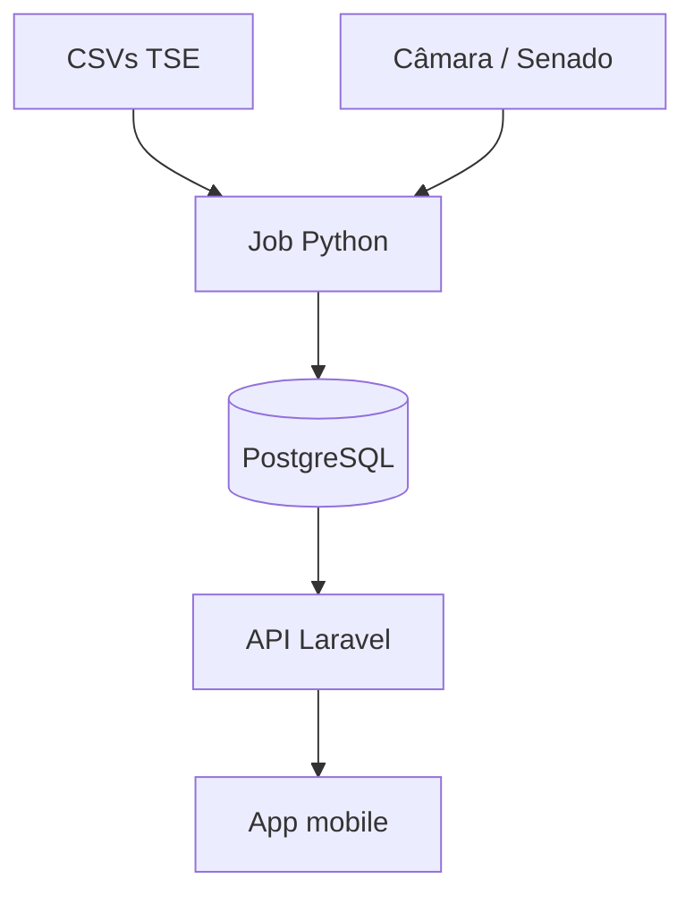

# ETL TSE (Python) — ingestão para o banco da API

A API Laravel **só lê** o PostgreSQL já populado. O job Python **escreve**. O app mobile não lê CSV e não chama o TSE.



O handshake entre API e ETL é o banco: `ingestion_runs` (status, arquivo, linhas) e `source_extracted_at` nas candidaturas. A API não precisa saber que o Python existe.

Documento irmão: [database-modeling.md](./database-modeling.md).

---

## O que não fazer

- Não chamar Python de controller, job Eloquent ou request HTTP.
- Não parsear CSV em PHP (encoding Latin-1, `;`, `#NULO#`, volume municipal).
- Não gravar linha a linha com pandas / `executemany` nas tabelas finais.
- Não colocar CSV oficial no git. Volume local ou object storage.
- Não inferir mandato a partir de `is_elected`.
- Não expor CPF, título ou e-mail na API. Identificadores ficam só em `person_identifiers`.

---

## Forma recomendada: pacote `etl/` + serviço no Compose

Mesmo repositório e mesmo Postgres, **processo separado**. O `docker-compose` sobe três serviços:

```
postgres  ←  único ponto em comum
api       ←  Laravel (leitura)
etl       ←  Python (escrita)
```

Estrutura no repo:

```
elections_api/
  app/                    # API Laravel
  etl/
    pyproject.toml
    src/elections_etl/
      cli.py              # ingest --year 2024 --dataset consulta_cand
      extract/            # download ZIP TSE, unzip, encoding
      staging/            # COPY para tabelas temporárias
      transform/          # upsert dimensões → pessoas → candidaturas
      load/
    tests/fixtures/       # CSVs minúsculos, não os oficiais
  docker-compose.yml
```

O ETL lê `DB_*` do mesmo `.env`.

- Local: `docker compose up` sobe API + ETL + banco.
- Produção: o container `etl` é cron / one-shot, não um servidor web.

Um `php artisan tse:ingest` **fino** (só `Process::run` no CLI do Python) é opcional para DX. A lógica fica no Python.

---

## Pipeline interno

Os CSVs do TSE (`consulta_cand`, `bem_candidato`, redes, `votacao_*`) são grandes, Latin-1, separados por `;`, com sentinelas `#NULO#` / `#NE#`. O caminho rápido e idempotente é **staging + SQL**, não ORM.

1. **Extract** — baixar o ZIP dos [dados abertos do TSE](https://dadosabertos.tse.jus.br/), descompactar, validar colunas. Abrir como `latin-1`, `sep=';'`.
2. **Staging** — `COPY` (ou `\copy`) para tabelas `UNLOGGED` 1:1 com o CSV. Esse é o gargalo: milhões de linhas entram em minutos.
3. **Transform / upsert** — SQL `INSERT ... ON CONFLICT`, na ordem da tabela abaixo.
4. **Auditoria** — cada execução abre e fecha uma linha em `ingestion_runs` (`running` → `success` / `failed`).

### Ordem de upsert

| Ordem | Fonte TSE | Destino | Chave de upsert |
| --- | --- | --- | --- |
| 1 | `consulta_cand` | `elections`, `offices`, `electoral_units`, `parties` | `CD_ELEICAO`, `CD_CARGO`, `SG_UE`, `(NR_PARTIDO, SG_PARTIDO)` |
| 2 | CPF / título | `people` + `person_identifiers` | `cpf` (cola da carreira) |
| 3 | mesma linha | `candidacies` + `candidacy_details` | `(election_id, tse_sq_candidato, turn)` |
| 4 | `bem_candidato` | `candidacy_assets` | por candidatura |
| 5 | redes / proposta | `candidacy_links` | por candidatura |
| 6 | `votacao_*` | `result`, `is_elected` | mesma chave da candidatura |

Bibliotecas: `psycopg` (COPY), `httpx` para download. Pandas só para inspeção; no load, COPY + SQL.

---

## Regras de transformação

- Congelar `party_acronym`, `office_name`, `uf`, `unit_name` em `candidacies` (a lista não faz 4 joins).
- Segundo turno = **nova linha**, não update da primeira.
- `is_elected` derivado de `CD_SIT_TOT_TURNO` / `DS_SIT_TOT_TURNO` (eleito, eleito por QP, eleito por média) — não `ILIKE 'eleito%'`.
- CPF e título **só** em `person_identifiers`. A API nunca lê essa tabela.
- O que sobrar do CSV vai para `candidacy_details.extra` (JSONB), não para coluna da lista.
- `ON CONFLICT` torna o job **idempotente**: rerodar o mesmo ZIP atualiza, não duplica.
- Lock (`pg_advisory_lock`) + `ingestion_runs` evitam dois loads simultâneos. A API continua servindo o dado anterior até o upsert terminar.

---

## Como dispara no dia a dia

| Ambiente | Como dispara |
| --- | --- |
| Local | `docker compose up` + `docker compose run etl ingest --year 2024` |
| Recorrente (campanha) | Cron no container `etl`, 1–4×/dia, com lock para não sobrepor |
| Laravel | Scheduler **não** executa o ETL pesado; no máximo um comando que dispara o container/CLI |

O ingest municipal pode levar dezenas de minutos. Isso vive num processo com timeout alto, **não** na queue `database` do Laravel (`retry_after` padrão 90s).

---

## Recorte de MVP

1. Só `consulta_cand` → dimensões + `people` + `candidacies` + `candidacy_details`.
2. Depois bens, links, resultados.
3. Câmara/Senado (`political_mandates`, `legislative_activities`) é **outro dataset** no mesmo pacote Python (`source=camara|senado` em `ingestion_runs`), não um segundo projeto.

Testes do ETL: fixtures de 20–50 linhas, não o ZIP nacional. Testes da API continuam com factories — o Laravel não precisa do Python no `php artisan test`.

---

## Produção (Laravel Cloud)

Laravel Cloud é PHP: workers e scheduler não são o lugar do COPY de milhões de linhas. O ETL fica como **job agendado fora** (GitHub Action, container no mesmo Postgres, VPS) escrevendo no banco da API. O contrato não muda: Python escreve, Laravel lê.
